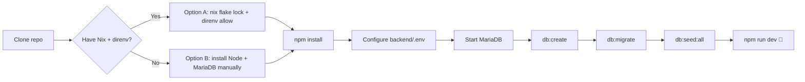

# 📝 Conduit RealWorld Example App


A fullstack "RealWorld" (Medium.com clone) implementation built with React, Express.js, Sequelize, and a SQL database. This README covers a local development setup using **Nix + direnv** for the toolchain and **MariaDB** as the database.

## 📚 Contents

- [Why this setup?](#-why-this-setup)
- [Prerequisites](#-prerequisites)
- [1. Clone the repo](#1-️-clone-the-repo)
- [2. Set up your toolchain](#2-️-set-up-your-toolchain)
- [3. Install project dependencies](#3--install-project-dependencies)
- [4. Install the MySQL driver](#4--install-the-mysql-driver)
- [5. Configure your .env file](#5--configure-your-env-file)
- [6. Add local state to .gitignore](#6--add-local-state-to-gitignore)
- [7. Start a local MariaDB server](#7--start-a-local-mariadb-server)
- [8. Create the database](#8--create-the-database)
- [9. Run migrations](#9--run-migrations)
- [10. Seed the database](#10--seed-the-database)
- [11. Start the development server](#11--start-the-development-server)
- [Testing](#-testing)
- [Production build](#-production-build)
- [Stopping the database](#-stopping-the-database)
- [Troubleshooting](#-troubleshooting)

## 🤔 Why this setup?

Node, npm, and a database engine are pinned inside a Nix flake rather than installed globally. That means:
- Exact versions are locked (`flake.lock`) — the environment behaves the same on any machine, months from now, without "works on my machine" drift.
- Nothing touches your system Node/MySQL install — this project's tools exist only inside this folder.
- `direnv` loads that environment automatically when you `cd` in, and unloads it when you `cd` out, so there's no manual `nix develop` step to remember.



## ✅ Prerequisites

- Git
- **Either** [Nix](https://nixos.org/download) (with flakes enabled) + [direnv](https://direnv.net/) — recommended, see Option A below
- **Or** Node.js v18.11.0+, npm, and a MySQL-compatible server (MySQL or MariaDB) installed some other way — see Option B below

> [!TIP]
> The `flake.nix` and `.envrc` files in this repo are inert if you don't have Nix/direnv installed — they don't get in your way, they just won't do anything. Feel free to ignore them entirely and follow Option B.

## 1. 📥 Clone the repo

```bash
git clone <this-repo-url>
cd conduit-realworld-example-app
```

## 2. ⚙️ Set up your toolchain

### Option A — Nix + direnv (recommended)

Reproducible and isolated: exact tool versions get pinned in `flake.lock`, nothing touches your system Node/MySQL install, and the environment loads/unloads automatically as you `cd` in and out. Requires teammates to also have Nix + direnv installed.

This repo already includes `flake.nix` and `.envrc` at the root — nothing to create. Just run, from the repo root:

```bash
nix flake lock                    # pins exact package versions into flake.lock
direnv allow                      # approves .envrc and loads the environment
```

From now on, `node`, `npm`, and the MariaDB binaries load automatically whenever you `cd` into this folder, and disappear when you `cd` out.

<details>
<summary>📄 Reference: contents of <code>flake.nix</code> and <code>.envrc</code></summary>

You shouldn't need to touch either of these unless you're changing the toolchain itself (e.g. adding a package, or updating the nixpkgs pin). Included here for reference:

**`flake.nix`**
```nix
{
  description = "Dev environment for conduit-realworld-example-app";

  inputs = {
    nixpkgs.url = "github:NixOS/nixpkgs/nixos-26.05";
    flake-utils.url = "github:numtide/flake-utils";
  };

  outputs = { self, nixpkgs, flake-utils }:
    flake-utils.lib.eachDefaultSystem (system:
      let
        pkgs = import nixpkgs { inherit system; };
      in
      {
        devShells.default = pkgs.mkShell {
          packages = with pkgs; [
            nodejs_22  # npm ships bundled with this
            mariadb    # MySQL-compatible; gives you mysqld, mysql, mysqladmin, mysqldump, etc.
          ];
        };
      });
}
```

**`.envrc`**
```
watch_file flake.nix
watch_file flake.lock

use flake
```

The two `watch_file` lines exist so direnv notices edits to `flake.nix` and reloads — without them, direnv can serve a stale cached environment after a change.

</details>

> [!WARNING]
> **If these files are somehow missing** (e.g. you're on a branch predating them, or they got accidentally gitignored) — recreate them from the reference above, then run `git add flake.nix .envrc` before `nix flake lock`. Nix's flake evaluator specifically checks Git's index, so an untracked `flake.nix` is invisible to it even though it's sitting right there on disk.

### Option B — Manual install

No Nix, no direnv — just install things the normal way for your OS:

1. Install Node.js v18.11.0+ and npm (via [nodejs.org](https://nodejs.org), your OS package manager, or a version manager like `nvm`).
2. Install a MySQL-compatible server — MySQL or MariaDB — via your OS's package manager, e.g.:
   ```bash
   # macOS (Homebrew)
   brew install mariadb
   brew services start mariadb

   # Debian/Ubuntu
   sudo apt install mariadb-server
   sudo systemctl start mariadb
   ```
3. Skip step 7 below (starting a local server manually) — your OS is already managing the server as a background service. Use your OS's normal start/stop/status commands (`brew services`, `systemctl`, etc.) instead of the `mariadb-install-db`/`mariadbd` commands shown there.

Everything from step 3 onward applies the same either way.

## 3. 📦 Install project dependencies

```bash
npm install
```

## 4. 🔌 Install the MySQL driver

The project ships with a Postgres driver (`pg`) pre-installed, because the stock README assumes Postgres. This setup uses MariaDB/MySQL instead, and Sequelize needs a dialect-specific driver to actually speak to it — without it, you'll get `Please install mysql2 package manually` the moment you try to connect:

```bash
npm install -w backend mysql2
```

## 5. 🔐 Configure your `.env` file

Create the file at **`backend/.env`** — not the repo root. The reason: `npm run sqlz` runs `sequelize-cli` via `npx -w backend`, and npm workspaces execute that with the working directory set to `backend/`. Sequelize CLI's `.env` loading resolves relative to that working directory, so a root-level `.env` gets silently ignored (you'll see `injecting env (0) from .env` if this happens).

```env
PORT=3001
JWT_KEY=supersecretkey_example

## Development Database
DEV_DB_USERNAME=root
DEV_DB_PASSWORD=
DEV_DB_NAME=database_development
DEV_DB_HOSTNAME=127.0.0.1
DEV_DB_DIALECT=mysql
DEV_DB_LOGGGIN=true

## Testing Database
TEST_DB_USERNAME=root
TEST_DB_PASSWORD=
TEST_DB_NAME=database_testing
TEST_DB_HOSTNAME=127.0.0.1
TEST_DB_DIALECT=mysql
TEST_DB_LOGGGIN=true

## Production Database
PROD_DB_USERNAME=root
PROD_DB_PASSWORD=
PROD_DB_NAME=database_production
PROD_DB_HOSTNAME=127.0.0.1
PROD_DB_DIALECT=mysql
PROD_DB_LOGGGIN=false
```

> [!IMPORTANT]
> Leave password fields genuinely empty (`DEV_DB_PASSWORD=`), not the word `null`. A freshly initialized MariaDB root user has no password, and the literal four-character string `"null"` gets sent as an actual password — MariaDB correctly rejects it as wrong credentials rather than treating it as "no password."

> [!NOTE]
> `LOGGGIN` (not `LOGGING`) is intentional here, not a typo to fix — it matches the variable name this repo's `config.js` actually reads. Worth double-checking against `backend/config/config.js` directly if you ever add new environments, since a "corrected" spelling would silently stop taking effect.

## 6. 🙈 Add local state to `.gitignore`

The database files and Nix/direnv caches are machine-specific generated state, not something to share or commit:

```gitignore
.devdb/
.direnv/
```

(`flake.nix` and `.envrc` themselves *should* stay tracked — that's what lets anyone else cloning the repo get the same environment.)

## 7. 🗄️ Start a local MariaDB server

> [!NOTE]
> This step is for **Option A (Nix)** only. If you're on **Option B**, your OS is already running MariaDB as a background service — skip straight to step 8.

This only needs to be done once per machine — it initializes an empty database cluster on disk at `.devdb/mysql`:

```bash
mkdir -p .devdb/mysql
mariadb-install-db --datadir="$PWD/.devdb/mysql" --auth-root-authentication-method=normal
```

Then, each time you want the database running (start of a work session):

```bash
mariadbd --datadir="$PWD/.devdb/mysql" --socket="$PWD/.devdb/mysql.sock" --port=3306 --bind-address=127.0.0.1 &
```

This backgrounds the server on `127.0.0.1:3306`, matching the hostname in `.env`. It's a manual step because the flake only provides the *binaries* — it doesn't manage a running service, so nothing starts a server for you automatically.

## 8. 🏗️ Create the database

```bash
npm run sqlz -- db:create
```

## 9. 🔀 Run migrations

This builds all the tables (`Tags`, `Articles`, `Users`, `Comments`) — order matters here because later tables (like `Comments`) reference earlier ones:

```bash
npm run sqlz -- db:migrate
```

## 10. 🌱 Seed the database

This populates dummy users, articles, and comments for local testing. Migrations must run first — seeders insert *rows*, they don't create tables, so seeding an empty database fails with `Table doesn't exist`:

```bash
npm run sqlz -- db:seed:all
```

## 11. 🚀 Start the development server

```bash
npm run dev
```

## 🧪 Testing

```bash
npm test
```

## 📦 Production build

```bash
npm start
```

## 🛑 Stopping the database

> [!NOTE]
> This applies to **Option A (Nix)** only. On **Option B**, stop the server the same way you started it (`brew services stop mariadb`, `systemctl stop mariadb`, etc.).

Unlike the Node/npm tooling, MariaDB doesn't unload automatically when you `cd` out — direnv has no equivalent "on exit" hook, so the server keeps running in the background even after you leave the folder. It's harmless (bound only to this project's local socket/port), but if you want to shut it down explicitly:

```bash
mariadb-admin --socket="$PWD/.devdb/mysql.sock" shutdown
```

## 🐛 Troubleshooting

- **`Access denied for user 'root'@'localhost'`** — check that `DEV_DB_PASSWORD` is empty, not `null` (see step 5).
- **`connect ECONNREFUSED 127.0.0.1:3306`** — MariaDB isn't running; repeat step 7's `mariadbd` command.
- **`Table '...' doesn't exist` during seeding** — migrations weren't run first; do step 9 before step 10.
- **`Unknown column 'userId' in 'INSERT INTO'` while seeding articles** — the `Articles` table's migration was missing a `userId` column that the model's `belongsTo(User)` association and the seeder both rely on. This has been added to `migrations/20220129140808-create-article.js` in this repo; if you're seeing this error, that fix hasn't been applied yet.
  <br>Note: it's added as a plain column, not a foreign-key constraint — `Articles` is created before `Users` in migration order, so a hard FK reference would fail at that point. Referential integrity here is enforced by Sequelize at the application level (the model association), not by the database itself.
- **Starting over from scratch** — to wipe and rebuild the database entirely:
  ```bash
  npm run sqlz -- db:migrate:undo:all
  npm run sqlz -- db:migrate
  npm run sqlz -- db:seed:all
  ```